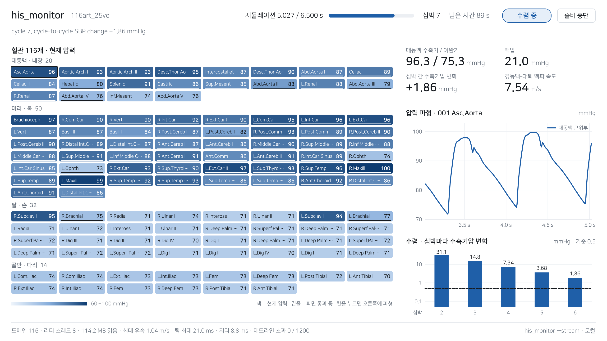

<div align="center">

# his_monitor

**돌고 있는 1차원 혈류 시뮬레이션을 실시간으로 들여다보고, 입력은 시작 전에 걸러냅니다.**

C로 짠 모니터 하나와 화면 두 가지(ssh만 있으면 되는 터미널 화면, Qt 창), 그리고 실행 전
입력 검사기.

[](https://github.com/hanincheol40/his_monitor/actions/workflows/ci.yml)


[English](README.md)

</div>



<div align="center"><sub>
실제 실행에 붙은 창입니다. 시뮬레이션 5.0초 시점이고 아직 수렴 중입니다. 칸 하나가 혈관
하나이고 색은 그 혈관의 지금 압력입니다. 새 박동이 머리와 목(진한 색)에는 도달했고 팔과
다리(옅은 색)에는 아직 닿지 않았습니다. 오른쪽은 최근 2초 동안의 대동맥 근위부 압력과,
심박마다 수축기압이 얼마나 변했는지입니다. 변화량이 심박마다 절반씩 줄어 0.5 mmHg 기준선을
향해 내려가는 중입니다.
</sub></div>

---

## 무엇이 문제였나

사람의 동맥망 시뮬레이션은 피험자 한 명당 수 분이 걸립니다. 연구 하나는 수천 명이니
며칠이 걸리고, 그 며칠 동안 원격 장비에서 화면 없이, ssh로 띄워 놓고 방치됩니다.

실행 시간은 문제가 아니었습니다. 문제는 입력 파일의 숫자 하나가 잘못돼도 그 사실이 전부
끝난 다음에야 드러난다는 것이었습니다. 혈관 반지름을 잘못 스케일한 탓에 며칠치 계산을
날린 적이 있습니다.

필요한 정보는 솔버가 이미 1 ms마다 디스크에 쓰고 있었습니다. 아무도 끝나기 전에 읽지
않았을 뿐입니다.

| 실행 파일 | 하는 일 |
|---|---|
| `his_monitor` | 이미 돌고 있는 실행에 붙어 116개 혈관을 실시간으로 그리고, 수렴·발산·정지를 판정. 판정이 나쁘면 종료 코드 2를 내므로 실행 스크립트가 해당 실행을 중단시킬 수 있음 |
| `his_gui` | 같은 모니터 위에 올린 Qt 창. 혈관 전체 격자, 고른 혈관 하나의 파형, 심박별 수렴 과정을 보여 줌. 내 PC의 실행도, ssh 너머 서버의 실행도 볼 수 있음. 창은 그리기만 하고 판단은 모니터가 함 |
| `preflight` | 입력 파일만 읽어서, 정상 동작이 확인된 설정과 다른 입력을 시작 전에 걸러냄 |

어느 것도 솔버를 건드리지 않습니다. 하는 일이 파일 읽기뿐이라, 모니터를 붙이든 떼든
실행에는 아무 영향이 없습니다.

## 요약

| | |
|---|---|
| 언어 | 모니터와 검사기는 C11 (libm과 pthreads만 사용, 따로 설치할 것 없음). 창은 C++17 + Qt 5 Widgets (선택 사항) |
| 분량 | C 2,405줄, 창 C++ 1,664줄, 테스트·테스트 데이터 생성기 1,107줄 |
| 병렬 처리 | 공유 작업 큐를 쓰는 워커 풀. 화면 갱신 주기마다 풀었다 다시 모음. 8스레드에서 읽기 6.3배 (116개 파일 147.7 MB: 1.01초 → 0.16초) |
| 주기 스케줄링 | 화면 갱신을 절대 시각 데드라인으로 스케줄링(`clock_nanosleep`, `CLOCK_MONOTONIC`). 데드라인 초과 횟수와 최대 지연을 세어 화면에 표시 |
| 벤치마크 | 첫 측정은 7.25배였음. 버리는 워밍업 패스를 넣어 두 측정이 같은 페이지 캐시를 보게 하자 6.3배가 됨 |
| 테스트 | 108건 (단위 83 + 검사기 종단 13 + 스트림 종단 12). 전부 실제로 발생했던 버그에서 나온 것 |
| CI에서 검사하는 것 | `-Werror` 빌드, 테스트 스위트, 그리고 모니터 실물 바이너리를 생성 데이터에 붙여 ThreadSanitizer / AddressSanitizer / UBSan 아래에서 실행. 여기에 cppcheck. 창은 `-Werror`로 빌드하고, 창의 파서로 실제 모니터 출력을 읽히고, 화면 없이 모니터에 붙여 실행 |
| 동작 환경 | Ubuntu 22.04 / GCC 11.4, ssh 접속만으로, 디스플레이 불필요 |

---

## 빌드와 실행

```sh
make            # -> his_monitor, preflight
make test       # -> 108건 검사
make gui        # -> gui/build/his_gui    (Qt 5와 CMake 필요. 나머지는 필요 없음)
```

터미널 두 개, 같은 디렉토리에서:

```sh
# 터미널 1: 솔버가 sim_1_1.his .. sim_1_116.his 를 쓰는 중
# 터미널 2, 둘 중 하나:
./his_monitor sim_1 --names 116_artery_model.txt              # 터미널에서
./gui/build/his_gui sim_1 --names 116_artery_model.txt        # 창으로
```

보통 실행은 서버에서 돕니다. 창은 내 PC에 두고 모니터만 서버에서 띄울 수 있습니다. 키
기반 ssh 접속이면 되고, 서버에는 `his_monitor` 말고 설치할 것이 없습니다.

```sh
./gui/build/his_gui sim_1 --ssh lab-server --dir /path/to/run --names 116_artery_model.txt
```

### 솔버 없이 바로 돌려보기

솔버는 이 저장소에 없으므로, 합성 이력 파일 생성기를 같이 두었습니다. 그럴듯한
압력 파형과 파일당 관측점 2개를 가진 116개 파일 트리를 만듭니다. 두 프로그램을 모두
돌려 보기에 충분하고, CI의 새니타이저 작업도 이 파일들을 대상으로 실행합니다.

```sh
sh tests/make_his.sh /tmp/demo synth 116 3000
./his_monitor /tmp/demo/synth --from-start
./gui/build/his_gui /tmp/demo/synth --from-start      # 또는 창으로
```

시뮬레이션 시간 3초, 심박 약 4회 분량입니다. 압력장이 채워지고 판정이 `CONVERGED`로
자리 잡으며, 상태 줄에서 리더 스레드 풀과 틱 타이밍이 실제로 일하는 것이 보입니다.
Ctrl-C(창이면 창 닫기)로 종료합니다.

> [!IMPORTANT]
> `-D_POSIX_C_SOURCE=200809L`은 반드시 필요하고, 모든 소스 파일이 첫 `#include` 앞에서
> 스스로 이 매크로를 정의합니다. `CFLAGS`에 있는 것은 새로 추가되는 파일도 같은 선언을
> 물려받게 하기 위한 것입니다. 이게 없으면 `-std=c11`이 표준 헤더에서 `strtok_r`,
> `clock_nanosleep`, `TIOCGWINSZ`를 감춥니다. 셋 중 둘은 요란하게 실패합니다.
> `clock_nanosleep`은 `int`를 반환하고, `TIOCGWINSZ`는 매크로라서 감춰지면 컴파일
> 오류입니다. 위험한 것은 `strtok_r`입니다. 암시적 `int` 반환 선언이 되면 반환된
> `char *`가 32비트로 잘려서 실행 중에 크래시가 납니다. `-Wall`은 이걸 경고하고 CI는
> 그 경고를 오류로 승격시키므로, 경고를 무시하거나 `-Wall`까지 빼야만 문제가 됩니다.
> 실제로 한 번 무시했고, 그래서 이 문단이 있습니다.

---

## 어떻게 동작하나

### 코드가 어디에 있나

| 파일 | 줄 수 | 내용 |
|---|---|---|
| `src/main.c` | 454 | CLI, 리더 스레드 풀, 주기 화면 갱신 루프, 종료 경로 |
| `src/hisfile.c` | 429 | 입력 파일 읽기, 출력 파일 따라 읽기 |
| `src/wave.c` | 485 | 맥파 발 검출, 맥파 속도, dSBP, 판정 |
| `src/render.c` | 219 | 터미널 화면 |
| `src/stream.c` | 172 | 같은 화면을 JSON 줄로 내보냄 (창이 읽음) |
| `src/preflight.c` | 458 | 독립 실행 입력 검사기 |
| `src/*.h` | 188 | 공용 타입 |
| `gui/src/` | 1,664 | Qt 창: 스트림 클라이언트, 혈관 격자, 파형, 수렴 |

### 리더 스레드 풀

화면 갱신 주기마다 116개 파일을 전부 읽어야 하는데, 파일 크기가 제각각입니다. 그래서
스레드에 동맥망을 미리 나눠 주지 않습니다. 하나의 큐를 공유하고, 뮤텍스 아래에서 다음
인덱스를 하나씩 집어 갑니다. 작은 파일을 맡은 스레드가 먼저 끝나고 노는 대신 바로 다음
일감을 가져가게 하려는 것입니다.

메인 스레드는 세대(generation) 카운터를 올리고 broadcast해서 한 틱을 시작합니다. 각
워커는 깨어나 큐를 비우고, 나가면서 활성 카운트를 하나 줄입니다. 마지막으로 나가는
워커가 메인 스레드를 깨우고, 메인은 그때까지 이번 틱의 모든 도메인이 읽힐 때까지
블록되어 있습니다. 세대 카운터가 이 깨우기를 안전하게 만듭니다. 이게 없으면 이전 틱을
아직 끝내는 중이던 워커가 broadcast를 놓치고, 그 틱은 영영 끝나지 않습니다.

실제로 겪은 문제에서 나온 두 가지:

- 풀 크기는 요청한 스레드 수가 아니라 실제로 만들어진 스레드 수로 정합니다.
  `pthread_create`가 도중에 실패하면(공용 클러스터의 `RLIMIT_NPROC` 제한은 실제로 있는
  경우입니다) 배리어가 영원히 도달하지 않을 숫자를 기다리며 `pthread_cond_wait`에서
  블록되는데, 거기에는 `SIGINT`가 닿지 않습니다. 빠져나올 방법이 `SIGKILL`뿐입니다.
- 헤더 파싱은 `strtok`이 아니라 `strtok_r`을 씁니다. 여덟 스레드가 동시에 헤더를
  파싱하는데 `strtok`은 커서를 프로세스 전역 static에 두므로, 두 스레드가 서로의 버퍼를
  헤집습니다. 헤더는 파일당 한 번만 나오니, 그 경쟁에서 진 도메인은 아무 경고 없이 실행
  내내 빈칸으로 남습니다.

### 주기 화면 갱신

화면 갱신은 절대 시각 데드라인을 갖는 주기 태스크입니다. 작업이 끝난 뒤 일정 시간을
자는 것이 아니라, 다음에 깨어날 시각을 먼저 정해 놓고
`clock_nanosleep(CLOCK_MONOTONIC, TIMER_ABSTIME)`으로 그 시각까지 잡니다. 상대 시간으로
자면 작업 시간이 매 주기에 누적되어 한없이 밀리지만, 절대 데드라인은 느린 틱 하나를
흡수하고 다음 틱을 제자리에 돌려놓습니다.

상태 줄은 이 스케줄러가 스스로를 계측한 결과입니다.

| 항목 | 의미 |
|---|---|
| `tick now/mean/max 0.5/1.6/121.6 ms` | 한 틱의 작업 시간. 116개 파일 읽기, 재계산, 다시 그리기까지 |
| `jitter 9.7 ms` | 지금까지 관측된 최대 지연. 한 주기가 데드라인보다 얼마나 늦게 시작했는지 |
| `0/116 late` | 데드라인 초과 횟수 / 완료한 틱 수. 작업이 다음 주기 시작 시각을 넘긴 틱을 초과로 셉니다 |

이 화면에서는 가장 느린 틱이 250 ms 주기에 대해 121.6 ms를 썼으므로 초과가 없습니다.
여기에 경성 실시간 보장은 없습니다([검증하지 못한 것](#검증하지-못한-것) 참고).

### 창, 그리고 왜 별도 프로세스인가

Qt 창은 `.his` 파일을 한 줄도 읽지 않고, 아무것도 판단하지 않습니다. `his_monitor
--stream`을 자식 프로세스로 띄우고, 돌아오는 것을 그립니다. 한 줄에 JSON 객체 하나씩:

```
{"type":"init", ...}   한 번: 혈관 이름, 부위, 최종 시각
{"type":"tick", ...}   화면 갱신 주기마다: 판정, 압력, 도달 시각, 파면,
                       직전 틱 이후의 파형 샘플, 심박별 수축기압
{"type":"exit", ...}   마지막: 종료 코드
```

이렇게 나눈 데는 이유가 있습니다. 스레드, 파일 따라 읽기, 판정은 모니터 쪽에 있고 전부
테스트와 새니타이저를 거칩니다. 그중 하나라도 창에 한 벌 더 구현하면 언젠가는 "이 실행이
정상인가"에 대해 터미널과 다른 말을 하게 됩니다. 여기서는 그럴 수 없습니다. 틱에 담긴
판정, dSBP, 도달 시각, 파면 표시는 터미널이 부르는 `wave.c`의 같은 함수가 계산한
값입니다.

소켓이 아니라 표준출력의 텍스트를 쓴 것도 의도한 것입니다. 모니터는 솔버가 도는 곳(보통
ssh로 들어가는 서버)에서 돌아야 하고, `--ssh`를 주면 창이 거기서 `ssh host his_monitor
... --stream`으로 모니터를 띄웁니다. 줄들은 ssh 채널을 타고 암호화·인증된 채로, ssh가
통과하는 방화벽이면 어디든 그대로 돌아옵니다. 소켓 서버였다면 포트, 방화벽 규칙, 자체
인증이 필요했고, 그러고도 할 수 있는 일은 더 적었습니다.

- CI가 스트림의 양 끝을 둘 다 검사합니다. 창 자신의 파서(`his_gui --check-stream`)로
  실제 모니터 출력을 읽히고, 이어서 창을 화면 없이 모니터에 붙여 돌려 프레임을 저장합니다.
  한쪽만 바뀌고 다른 쪽이 따라가지 않으면, 엉뚱한 그림을 그리는 대신 빌드가 실패합니다.
- 슬라이드에 캡처해 넣을 것을 전제로 만들었습니다. 파랑은 강조, 회색은 구조, 검정은
  본문, 그리고 빨강 하나는 "이 실행이 실패하고 있다"만 뜻합니다. 압력은 터미널의
  무지개가 아니라 파랑 한 색의 진하기입니다. 전부 `QPainter`로 그렸고 차트 라이브러리는
  쓰지 않았습니다.
- "솔버 중단" 버튼은 명령줄의 입력 파일 이름으로 솔버를 찾고, 찾은 것을 보여 준 뒤,
  확인을 받고서야 `SIGTERM`을 보냅니다. 첫 버전은 `sim_1.in`을 찾았는데 실제 솔버를 하나도
  찾지 못했습니다. 실행 중인 솔버는 자기 인자 문자열을 제자리에서 고쳐 써서, `ps`에는
  `sim_1 in`으로 보이기 때문입니다. 버튼의 검색 패턴을 실제 실행에 대 보다가 드러났고,
  지금은 두 형태를 모두 잡습니다.

---

## 구현하며 부딪힌 문제

이 프로젝트에서 어려웠던 것은 생리학이 아니었습니다. 다른 프로세스가 지금 이 순간 쓰고
있는 파일은 보통의 파서가 세우는 거의 모든 가정을 깨뜨립니다. 1~5번은 모니터를 만들면서,
6번과 7번은 창을 만들면서 찾았습니다. 같은 숫자를 두 번째 화면에 그려 보면 첫 번째 화면이
조용히 틀려 있던 곳이 드러납니다.

### 1. 남이 쓰고 있는 파일 따라 읽기

마지막 줄은 늘 절반만 쓰여 있습니다. 그걸 읽으면 잘린 행이 나오는데, 문제는 그게 멀쩡한
숫자로 파싱된다는 것입니다. 시계열이 소리 없이 망가집니다. 그래서 매번 읽기 전에 파일
위치를 저장하고, 줄이 개행으로 끝나지 않으면 되돌립니다. `clearerr()`도 필요합니다.
`fgets`가 한 번 EOF를 보면 스트림이 그 상태를 물고 있어서, 파일이 커진 뒤에도 이후 읽기가
전부 빈손으로 돌아오기 때문입니다. 단 `ferror`를 먼저 확인해야 합니다. 안 그러면 진짜
읽기 오류가 "아직 새 게 없음"과 똑같아 보여서, 죽은 스트림을 조용히 계속 폴링하게 됩니다.

### 2. 컬럼 이름 자체에 쉼표가 들어 있다

컬럼 이름에 인자 목록이 붙어 있는데(`P(x,t)`), 필드 구분자도 쉼표입니다. 쉼표로 자르면
`P(x`와 `t)`로 쪼개져서 7개 컬럼이 12개가 되고, 그 뒤 컬럼 인덱스가 전부 밀립니다. 괄호
부분을 먼저 제거한 뒤에 자릅니다. 컬럼 구성 자체도 실행 옵션에 따라 달라지므로, 가정하지
않고 파일에서 읽습니다.

### 3. 기본 모드는 끝으로 건너뛰기 전에 헤더를 읽어야 한다

레이아웃은 파일 맨 위에 딱 한 번 선언되고, 그게 파싱되기 전까지 모든 데이터 행은
버려집니다. 그러니 파일 끝으로 바로 seek해서 따라가면, 실행 내내 읽기는 읽는데 하나도
받아들이지 않습니다. 바이트 수는 세고 있어서 겉보기엔 바빠 보이고, 그러다 "샘플 없음,
파일 이름이 틀림"이라며 멀쩡한 명령을 탓합니다. 이게 기본 경로였는데 오래 살아남았습니다.
스크린샷도, 벤치마크도, 테스트도 전부 `--from-start`를 썼고, 그 경로는 지나가는 길에
헤더를 읽기 때문입니다. 아무도 테스트를 쓰지 않은 경로에 대해서는 테스트 스위트 전체가
조직적으로 눈이 멀 수 있습니다.

### 4. 맥파 발 검출기는 압력 수준이 아니라 시간으로 상태를 빠져나온다

최솟값을 들고 있다가 압력이 그 위로 올라오면 발화하는 것까지는 쉬운 절반입니다. 함정은
빠져나오는 쪽입니다. 당연해 보이는 조건은 압력이 방금 기록한 이완기 최솟값으로 돌아올
때까지 기다리는 것인데, 이 조건은 첫 심박에서 영영 풀리지 않습니다. 그 최솟값이 t=0
시작값이고, 해는 다시는 거기로 돌아가지 않기 때문입니다.

### 5. 두 지점의 맥파 발(foot)은 같은 심박에서 나와야 한다

파는 대동맥 기점 대비 경동맥에 약 15 ms, 대퇴동맥에 약 134 ms 뒤에 도달합니다. 그래서
730 ms짜리 주기의 약 1/6 구간에서는 한쪽이 이번 심박의 발을, 다른 쪽이 아직 이전 심박의
발을 들고 있습니다. 그걸 빼면 음수 전달 시간이 나옵니다. 같은 함정이 두 번 나타났습니다.
맥파 속도에서는 실제 161프레임 중 30프레임에서 0으로 무너져 판정이 그 검사를 통째로
건너뛰게 만들었고, 각 칸에 찍히는 도달 시각에서는 발목에 −656 ms가 표시됐습니다. 지금은
둘 다 그럴듯한 전달 시간 구간에 들어오는 차이를 찾는 방식으로 발을 짝짓습니다. 주기
번호로 짝짓는 것이 당연해 보이는 해법이지만 틀렸습니다. 카운터가 실행 도중 서로 어긋나서,
그 버전은 180프레임 중 180프레임에서 0을 반환했습니다.

### 6. 끝난 실행이 조용한 건 끝났기 때문이다

정지 감시가 최종 시각을 몰라서, 정상적으로 끝난 실행이 마지막 스텝 20초 뒤면 전부
`STALLED`가 됐습니다. `--abort-on-fail`에서는 종료 코드 2, 즉 성공한 실행을 실패로
보고했습니다. 판정만 고쳤다면 더 나빴습니다. 그러면 스크립트는 영원히 끝나지 않는 모니터를
기다리게 됩니다. 지금은 최종 시각에 도달한 도메인만 면제합니다. 그 도메인만 면제하므로,
중간에 멈춘 도메인은 다른 도메인이 다 끝난 뒤에도 잡힙니다. 모든 도메인이 도달해야 실행이
끝난 것으로 보며, 그때 `--abort-on-fail`은 실행 자신의 판정으로 종료합니다. 창이 끝난
실행을 빨갛게 칠하는 것을 보고 찾았습니다.

### 7. 심박 간 변화는 최고점을 기다려야 한다

새 발이 잡히면 수축기압 추적값이 발 지점의 압력, 즉 이완기 근처로 리셋되고, 진짜
최고점까지 올라오는 데 0.1초쯤 걸립니다. 그 상승기에 읽은 dSBP는 기준 실행의 마지막
심박(확정된 변화량이 0.49인 심박)의 14% 동안 −18.4 mmHg까지 튀었고, 오래전에 수렴한
실행의 판정이 심박마다 `CONVERGING`으로 깜빡였습니다. 지금은 이번 심박의 최고점이 확정될
때까지 직전 심박의 확정값을 유지합니다. 창의 수렴 그래프가 자기 판정 배지와 어긋나는 것을
보고 찾았습니다. 같은 숫자를 터미널, 스트림, 판정 세 곳이 각자 계산하고 있었고, 이제는
함수 하나로 합쳤습니다.

1번, 3번, 5번, 7번은 이미 끝난 파일로는 아예 재현되지 않습니다. 아직 돌고 있는 솔버
앞에서만 나타납니다.

---

## 화면 읽는 법

실제 실행에 붙인 터미널 화면입니다. 창도 같은 코드가 계산한 같은 숫자를 보여 주는데,
여기서는 모든 숫자가 한 화면에 다 나오는 터미널로 읽어 보겠습니다.


### 상단 줄

| 줄 | 의미 |
|---|---|
| `sim 5.128 / 6.500 s [####....] wall 29s eta 83s` | 시뮬레이션 시간과 진행률. `wall`은 모니터가 떠 있는 시간이지 솔버 실행 시간이 아닙니다. `eta`는 모니터가 보고 있는 동안 시뮬레이션 시간이 얼마나 빨리 진행되는지로 계산하며, 그래서 중간에 붙어도 값이 맞습니다. 이 화면의 진행 속도로 역산하면 모니터가 붙은 시점에 솔버는 약 280초째 돌고 있었습니다 |
| `CONVERGING cycle 7, cycle-to-cycle SBP change +0.86 mmHg` | 판정과 그 근거가 된 숫자 |
| `aortic root 100.6 / 75.3 mmHg  PP 25.4  dSBP +0.86  cf-PWV 7.54 m/s` | 생리량: 수축기/이완기압, 맥압, dSBP(최고점이 확정된 마지막 두 심박 사이의 수축기압 변화), 맥파 속도 |
| `116 domains  8 reader threads  116.4 MB read  peak \|U\| 1.04 m/s  tick … jitter … late` | 도구가 스스로를 보고하는 부분. [주기 화면 갱신](#주기-화면-갱신) 참고 |

### 칸 하나의 구성

```
048 L.Post.Tibial    68  166
│   │                │   │
│   │                │   └─ 대동맥 기점 대비 파 도달 시각 [ms]
│   │                └───── 현재 압력 [mmHg]
│   └────────────────────── 혈관 이름 (--names 표에서)
└────────────────────────── 구간 번호

011 R.Ulnar II      125 > 78
                        │
                        └── 지금 이 순간 동맥망에서 가장 빠르게 상승 중인 혈관의
                            45% 이상으로 상승 중 = 파면이 이 혈관을 지나가는 중
```

스크린샷의 도달 시각은 0 → 54~85 ms(팔) → 134 ms(대퇴) → 163~168 ms(발목)으로, 맥파가
동맥망을 타고 내려가는 것이 실시간으로 보입니다.

색은 무지개 색상표입니다. 이 분야가 이미 논문에 싣는 그림과 맞춰서, 한 프레임을 기준
그림과 눈으로 대조할 수 있게 하려는 선택입니다. 일반적으로는 좋은 색상표가 아닙니다.
지각적으로 균일하지 않고 적록색약에 불리합니다. 더 나은 색상표라서가 아니라 기존 그림과
대조하기 위해 쓴 것입니다.

### 판정

위에서부터 검사하고, 먼저 일치하는 판정이 적용됩니다.

| # | 판정 | 조건 |
|---|---|---|
| 1 | `STALLED` | 아무것도 도착하지 않았거나, `--stall` 초 동안 어디에서도 새 샘플이 없음. 단, 모든 도메인이 최종 시각에 도달했다면 멈춘 게 아니라 끝난 것 |
| 2 | `OFF TARGET` | 어떤 도메인이 nan/inf를 쓴 적이 있음(해가 발산). 래치됨: 잘못된 행 하나면 실행이 끝날 때까지 유지 |
| 3 | `STALLED` | 일부 도메인만 조용하고 나머지는 기록 중. `--stall` 초가 지나도록 한 번도 안 썼거나, 마지막 기록이 3×`--stall` 초보다 오래됨 |
| 4 | `FILLING` | 아직 심박 두 번이 안 됨. 압력장이 채워지는 중 |
| 5 | `OFF TARGET` | 최대 \|U\|가 `--umax` 초과. 해당 도메인을 지목 |
| 6 | `OFF TARGET` | 맥파 속도가 `--pwv-target`의 `--tol` 범위 밖 |
| 7 | `CONVERGED` | dSBP가 0.5 mmHg 미만. 해가 주기적으로 안정됨 |
| 8 | `CONVERGING` | 0.5 mmHg 이상, 또는 아직 확정된 심박이 하나뿐 |

6번은 일부러 도달하기 어렵게 만들었습니다. 해가 안정된 뒤에만 적용되는데, 여기서
안정이란 주기 간 변화가 3 mmHg 미만이거나, 또는 심박 다섯 번이 지나도록 안정될 기미가 없는
경우입니다. 채워지는 과도 구간에서 맥파 속도를 판정하면 멀쩡한 실행을 죽입니다. 이 가드를
넣기 전에 실제로 3번째 주기에서 그랬습니다.

`--abort-on-fail`을 켠 상태에서 `OFF TARGET`이나 `STALLED`이면 종료 코드는 2이므로,
실행 스크립트가 이를 보고 대응할 수 있습니다. 그리고 모든 도메인이 최종 시각에 도달하면
모니터는 실행 자신의 판정으로 스스로 종료합니다. 안정됐으면 0, 목표를 벗어난 채
끝났으면 2입니다.

<details>
<summary><b>his_monitor 전체 옵션</b></summary>

```
--names <file>       구간 번호 ↔ 혈관 이름 대응표. 칸에 이름을 붙임
--from-start         지금부터 덧붙는 부분만 따라가지 않고 파일 처음부터 읽음
--proximal           원위(distal)가 아니라 근위(proximal) history point를 관찰
--period <ms>        화면 갱신 주기, 기본 250, 최소 20
--threads <n>        읽기 스레드 수, 기본 min(8, 코어 수), 1~64로 제한
--pwv-target <m/s>   이 피험자의 예상 경동맥-대퇴동맥 맥파 속도
--tol <pct>          맥파 속도가 얼마나 벗어나면 실패로 볼지 (10)
--umax <m/s>         이 값을 넘는 최대 |U|는 목표 이탈로 판정
                     (기본 2.0, 0이면 검사 끔)
--stall <s>          몇 초 동안 새 샘플이 없으면 정지로 볼지 (20)
--abort-on-fail      OFF TARGET 또는 STALLED가 화면 갱신 3주기 연속이면 종료
                     코드 2로 종료. 단, 진행이 관측된 실행만 중단시킴. 아직
                     메시 준비 중인 솔버는 화면에 STALLED로 보여도 죽이지 않음.
                     모든 도메인이 최종 시각에 도달하면 스스로 종료: 안정됐으면
                     0, 목표를 벗어난 채 끝났으면 2
--bench              전체 읽기 시간 측정: 워밍업, 1스레드, N스레드, 다시 1스레드.
                     네 시간을 출력하고 종료
--stream             화면을 그리는 대신 화면 갱신 주기마다 JSON 객체 하나를
                     표준출력으로 씀 (창이 읽는 형식). ssh 너머에서도 그대로
                     동작: ssh host his_monitor ... --stream
```

tty가 없을 때는 `COLUMNS`와 `LINES` 환경변수를 따릅니다. 덕분에 터미널 없이도 레이아웃을
테스트할 수 있고, CI가 실물 바이너리를 돌릴 수 있습니다.

</details>

<details>
<summary><b>his_gui 전체 옵션</b></summary>

```
사용법: his_gui <base> [his_monitor 옵션] [옵션]

--monitor <path>      실행할 his_monitor. 기본: his_gui 옆, ../his_monitor,
                      ../../his_monitor, 그다음 PATH
--ssh <host>          모니터를 <host>에서 ssh로 실행 (키 인증). 창은 여기 그대로
--dir <path>          --ssh 와 함께, 그 호스트의 작업 디렉토리
--capture <dir>       --every 초마다 창을 PNG로 저장
--every <s>           캡처 간격, 기본 10
--scale <n>           캡처 배율, 기본 2 (슬라이드에서 선명하게)
--quit-after <s>      이 시간이 지나면 닫기
--check-stream <file> 저장해 둔 --stream 기록을 창 자신의 파서로 읽고 보고.
                      이상 없으면 종료 코드 0. 디스플레이 불필요

나머지는 전부 his_monitor 로 그대로 전달: --names, --from-start, --period,
--threads, --pwv-target, --tol, --umax, --stall, --abort-on-fail
```

</details>

<details>
<summary><b>preflight 전체 옵션</b></summary>

```
사용법: preflight <file.in> [more.in ...] [--ref good.in] [-v]

--ref <file.in>   정상 동작이 확인된 입력과 비교. 같은 계열에서 가져올 것.
                  무관한 모델과 비교하면 전부 경고로 표시됨. 검사 목록에도
                  들어 있으면 건너뜀
--zlim <x>        말단 Windkessel R이 혈관 임피던스의 x배를 넘으면 경고.
                  기본은 꺼짐. 아래 설명 참고
--cfl <x>         Courant 수가 x를 넘는 도메인을 경고 (기본 0.40)
--rtol <pct>      --ref 와 함께, 반지름이 얼마나 달라지면 경고할지 (기본 15).
                  비(ratio)의 로그로 검사하므로 비에 대해 대칭이고 퍼센트에
                  대해서는 비대칭입니다: 15는 13.0% 작아지거나 15% 커질 때 걸림
-v                통과한 입력도 출력

종료 코드 0  전부 이상 없음
종료 코드 1  하나 이상 경고, 또는 검사할 것이 없음
```

</details>

---

## preflight

3분 뒤에 발산을 잡는 것도 좋지만, 아예 시작하지 않는 편이 더 낫습니다.

```sh
./preflight sim_*.in --ref <정상동작이_확인된_입력>.in
```


`preflight`는 입력 파일이 스스로 담고 있는 형상 수식으로부터 도메인마다 다음을
검사합니다. 혈관 반지름이 구간 전체에서 양수로 유지되는지, 외부 압력으로 눌린 뒤에도
초기 단면적이 양수인지, 명시적 시간 적분이 가능할 만큼 `CFL = dt·c/dx`가 작은지(파속
`c`는 모델 자신이 쓰는 경험적 벽 법칙에서 가져옴), 그리고 `--ref`를 주면 정상 입력 대비
반지름이 얼마나 벗어났는지.

### 임계값을 정한 방법

정상 동작이 확인된 입력에서 출발해, 말단 경계조건은 그대로 두고 모든 반지름에 상수를
곱한 다음, 각각을 실제로 돌려 봤습니다.

| 배율 | ×0.90 | ×0.80 | ×0.78 | ×0.76 | ×0.75 | ×0.74 | ×0.72 | ×0.70 | ×0.60 | ×0.50 |
|---|---|---|---|---|---|---|---|---|---|---|
| 솔버 | 동작 | 동작 | 동작 | 동작 | **동작** | **죽음** | 죽음 | 죽음 | 죽음 | 죽음 |

경계는 반지름 약 25% 감소 지점이고, 전이 구간이 매우 좁습니다. 기본 `--rtol` 15%는
그보다 작은 이탈에서 걸리도록 일부러 잡은 값입니다. 위 10개 스윕 전체에 대해 실패 5건은
모두 검출했고, 정상 5건 중 4건은 오경보였습니다. 스크린샷은 같은 스윕의 6개
부분집합입니다. 거기서는 ×0.80, ×0.76, ×0.75가 경고로 뜨지만 셋 다 실제로는 정상
동작하고, 진짜로 죽는 것은 ×0.74와 ×0.70입니다.

이 비대칭은 의도한 것입니다. 오경보의 비용은 파일 한 번 열어보는 것이고, 미검출의
비용은 며칠짜리 실행의 일부입니다.

### 하지 못하는 것

`preflight`는 제1원리로부터 발산을 예측하지 못합니다. `--ref` 없이 돌리면, 첫 번째
시간 스텝에서 죽는 입력에도 `OK`를 출력합니다. 반지름 양수, 초기 단면적 양수,
CFL 0.174로, 여기서 할 수 있는 모든 제1원리 검사를 통과하기 때문입니다. 정상 설정을
비교 대상으로 줬을 때만 잡아내며, 그 기준 입력은 같은 계열이어야 합니다.

말단 임피던스 `R/Z0`는 출력은 하지만 실패 판정에는 쓰지 않습니다. 여기서는 정상 입력과
비정상 입력을 가르지 못하기 때문입니다. 측정된 최댓값이 정상 동작하는 입력의 것이고,
확실히 죽는 입력은 중간값입니다. 동작하는 임계값이 없으므로 임계값을 두지 않았습니다.
숫자만 보여 주고, 근거를 가진 사람을 위해 `--zlim`을 남겨 뒀습니다.

---

## 검증한 것

| | 방법 |
|---|---|
| 빌드 | `-O2 -std=c11 -Wall -Wextra -pedantic -Werror`, 경고 0 (CI) |
| 테스트 | 파싱·분석·판정 계층 83건, 검사기 종단 13건, `--stream` 바이트 스트림 종단 12건 (CI) |
| 실물 바이너리 + 새니타이저 | CI가 합성 116개 파일 트리를 만들고(`tests/make_his.sh`, 솔버 불필요) `his_monitor` 자체를 거기에 붙여 실행. `--bench` 패스, follow 모드 라이브 실행, 스트림 테스트를 ThreadSanitizer 아래에서, 다시 ASan + UBSan 아래에서 돌림. 레이스 0건, 오류 0건 |
| 정적 분석 | cppcheck 경고 0 (CI) |
| 창 | `-Werror`로 빌드, 창의 파서로 실제 모니터 출력을 읽힘, 화면 없이 모니터에 붙여 프레임을 그림 (CI). 맨 위 스크린샷은 실제 6.5초 솔버 실행에 붙여 찍은 것으로, 틱 1,680번에 데드라인 초과 0, 솔버가 끝나고 정지 판정 기준(20초)을 넘긴 25초 뒤에도 `STALLED`가 아니라 `CONVERGED` |
| 병렬 읽기 | 실제 116개 파일 147.7 MB: 1스레드 1.01초 → 8스레드 0.16초, 6.3배 (반복 시 6.3~6.5) |
| 커버리지 | 마지막 프레임에서 116개 도메인 전부가 값을 보고. 1·2·8스레드 모두 동일 |

벤치마크는 버리는 워밍업, 1스레드, N스레드, 다시 1스레드 순서로 네 번 돌립니다. 측정
순서만 바꿔도 답이 달라지기 때문입니다. 첫 버전은 1스레드 다음 N스레드로 재고 7.25배라고
보고했는데, 두 측정을 같은 페이지 캐시 상태에 두는 워밍업을 넣자 6.3배로 내려갔습니다.
뒤에 붙은 1스레드 측정은 그 사이에 뭔가 변했는지를 알려 줍니다.

새니타이저 항목은 굳이 풀어 쓸 값어치가 있습니다. 당연해 보이는 방법이 틀리기
때문입니다. 단위 테스트는 파싱 계층을 직접 링크할 뿐 스레드를 하나도 만들지 않으므로,
그것을 ThreadSanitizer로 돌려 봐야 스레드 풀에 대해서는 아무것도 증명하지 못합니다.
그래서 CI는 실제 `his_monitor` 바이너리를 빌드해서 돌립니다.

## 검증하지 못한 것

누가 찾아내게 두지 않고 여기 적어 둡니다.

- `--umax` 검사는 검증된 적이 없습니다. 여기서 재현 가능한 실패는 전부 첫 시간 스텝에서
  죽어서, 이 검사가 잡으려는 완만한 유속 상승이 일어나지 않습니다. 근거 있는 설계이지만
  검증된 것은 아닙니다.
- 맥파 속도는 독립적인 기준에 대한 종단 검증이 없습니다. 벽 법칙 수식 자체는 문헌값과
  3% 이내로 확인했지만, 그것은 수식을 검증한 것이지 이 도구의 발 검출과 경로 정의를
  검증한 것이 아닙니다.
- RTOS가 아니고, 경성 실시간 보장도 없습니다. 일반 리눅스에서 `CLOCK_MONOTONIC` 기준
  절대 데드라인으로 `clock_nanosleep`하고, 지연과 초과를 세어 표시하는 정도입니다.
  스케줄링 규칙과 계측이지 결정성이 아닙니다.
- 창의 "솔버 중단" 버튼은 실제 실행에 대 보고 어떤 프로세스를 찾는지 확인했습니다. 솔버만
  찾고, 모니터도 창도 건드리지 않습니다. 하지만 버튼을 누르는 것까지는 자동화하지
  않았습니다. CI에는 멈출 솔버가 없고, 확인 대화상자는 사람이 눌러야 합니다.
- 위의 벤치마크, 반지름 스윕, 프레임 수는 개발 장비에서 실제 솔버 실행에 붙여 측정한
  값입니다. 솔버도 솔버 데이터도 들어 있지 않은 이 저장소만으로는 재현되지 않습니다.
- 이 도구는 실제 문제에서 출발했지만 연구가 끝난 뒤에 만들었습니다. 실제 연구의 실행
  시간을 줄이는 데 쓰인 적은 아직 없습니다.

---

## 범위

이 저장소에는 제가 작성한 코드(C 도구, Qt 창, 테스트)만 들어 있습니다. Qt 자체는 포함하지
않으며, 창은 LGPL 라이선스에 따라 Qt를 동적으로 링크합니다. 출력을 읽는 대상인 1차원
솔버는 Nektar1D이고, King's College London의 저작물이며, 비상업 연구 목적으로만 사용하도록
허락받았고 재배포는 허용되지 않습니다. 그 솔버는 여기에 포함되어 있지 않습니다. 소스도,
입력도, 출력도 없고, 이 저장소의 어떤 부분도 그 코드를 재현하지 않습니다. 모든 것은 실행
중에 관찰한 파일 형식만으로 동작하며, `tests/`에 쓰이는 합성 파일은 그 옆에 있는 셸
스크립트가 만들어 냅니다.

116개 혈관 모델과 그것이 속한 맥파 데이터베이스는 Charlton 등이 오픈 액세스로 공개한
것이며, `--names` 옵션이 읽는 혈관 이름 표도 그 공개 자료의 일부이므로 마찬가지로 여기
포함되어 있지 않습니다.

## 라이선스

MIT. [LICENSE](LICENSE) 참조.
