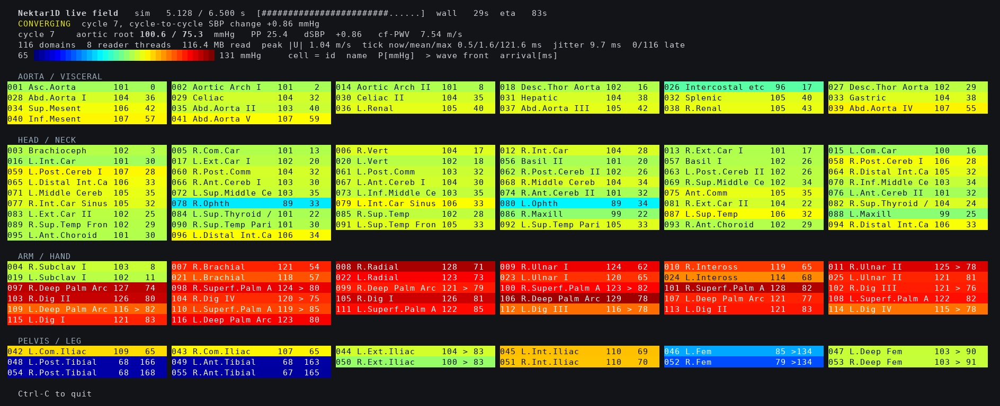
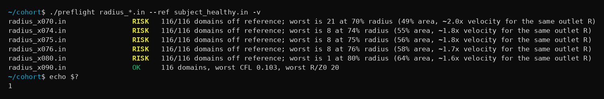

<div align="center">

# his_monitor

**Watch a 1-D blood flow simulation while it runs, and screen its inputs before it starts.**

Two small C programs. No external dependencies, no X11 — works over a plain ssh session.

[](https://github.com/hanincheol40/his_monitor/actions/workflows/ci.yml)


[한국어 설명](README.ko.md)

</div>



<div align="center"><sub>
A real run, five seconds of simulated time in. Each coloured cell is one blood vessel, and
the colour is its pressure right now. The pulse has already reached the arms (the red block
in the middle) and has not yet reached the ankles (the blue cells at the bottom left).
</sub></div>

---

## The problem

A simulation of the human arterial tree runs for minutes per patient. A study is thousands
of patients, so it runs for days — on a remote machine, with no screen, started over ssh
and left alone.

**The runtime was never the problem.** The problem was that one wrong number in an input
file only showed up *after* all of it had finished. A mis-scaled vessel radius cost days of
compute before anybody saw it.

The solver was already writing everything needed, every millisecond, to disk. Nobody was
reading it until the end.

| binary | what it does |
|---|---|
| **`his_monitor`** | attaches to a run that is already going and draws all 116 vessels live, judging convergence, divergence and stall as it goes. Exits 2 on a bad verdict, so a launch script can kill the run |
| **`preflight`** | reads input files only, and flags ones that differ from a configuration known to work — **before** anything is started |

Neither program touches the solver. Attaching or detaching the monitor has no effect on the
run, because all it does is read files.

## At a glance

| | |
|---|---|
| **Language** | C11. libm and pthreads only — nothing to install |
| **Size** | 2,038 lines of tool code, 967 lines of tests and test fixtures |
| **Concurrency** | worker pool over a shared work queue, released and rejoined once per display period; **6.3×** read speedup on 8 threads (147.7 MB across 116 files: 1.01 s → 0.16 s) |
| **Real-time discipline** | periodic display task scheduled on absolute deadlines (`clock_nanosleep`, `CLOCK_MONOTONIC`), with missed deadlines and worst-case lateness counted and shown on screen |
| **Measurement honesty** | the first benchmark reported **7.25×**; adding a discarded warm-up pass, so both timed passes see the same page cache, brought it to 6.3× |
| **Tests** | **79 checks** (66 unit + 13 end-to-end). Every one was written from a bug that actually happened |
| **Checked in CI** | `-Werror` build, the test suite, then the **real monitor binary** run against generated data under ThreadSanitizer, AddressSanitizer and UBSan, plus cppcheck |
| **Runs on** | Ubuntu 22.04 / GCC 11.4, over ssh, no display needed |

---

## Build and run

```sh
make            # -> his_monitor, preflight
make test       # -> 79 checks
```

Two terminals, same directory:

```sh
# terminal 1: the solver, writing sim_1_1.his .. sim_1_116.his
# terminal 2:
./his_monitor sim_1 --names 116_artery_model.txt
```

> [!IMPORTANT]
> `-D_POSIX_C_SOURCE=200809L` is required, and every source file defines it for itself
> before its first include — the `CFLAGS` entry is there so a newly added file inherits it
> too. Without it, `-std=c11` hides `strtok_r`, `clock_nanosleep` and `TIOCGWINSZ` from the
> standard headers. Two of those three fail loudly: `clock_nanosleep` returns `int`, and
> `TIOCGWINSZ` is a macro, so hiding it is a compile error. **`strtok_r` is the dangerous
> one** — an implicit `int`-returning declaration truncates the returned `char *` to 32
> bits and the program crashes at run time. `-Wall` does warn about it, and CI promotes
> that warning to an error, so this only bites if the warning is ignored or `-Wall` is
> dropped as well. It was ignored once, which is why this note exists.

---

## How it works

### Where the code lives

| file | lines | what is in it |
|---|---|---|
| `src/main.c` | 405 | CLI, the reader pool, the periodic display loop |
| `src/hisfile.c` | 429 | reading the input file and tailing the output files |
| `src/wave.c` | 381 | pulse foot detection, wave speed, the verdict |
| `src/render.c` | 229 | terminal layout and colour |
| `src/preflight.c` | 458 | the standalone input checker |
| `src/*.h` | 136 | shared types |

### The reader pool

116 files have to be read every display period, and they are wildly uneven in size. Threads
therefore do **not** get a fixed slice of the tree. They share one queue and take the next
index off it under a mutex, so a thread that draws a small file comes back for another
instead of finishing early and idling.

The main thread publishes a tick by bumping a generation counter and broadcasting; each
worker wakes, drains the queue, and decrements an active count on the way out. The last one
out signals the main thread, which is blocked until every domain in this tick has been
read. The generation counter is what makes the wakeup safe: without it, a worker that was
still finishing the previous tick when the broadcast went out would miss it and the tick
would never complete.

Two details worth naming, both from things that went wrong:

- The pool is sized by **how many threads actually started**, not by how many were asked
  for. If `pthread_create` fails partway — `RLIMIT_NPROC` on a shared cluster is a real
  case — the barrier waits for a count that will never be reached, and it blocks in
  `pthread_cond_wait`, where `SIGINT` does not reach it. The only way out is `SIGKILL`.
- Header parsing uses `strtok_r`, not `strtok`. Eight threads parse headers concurrently
  and `strtok` keeps its cursor in one process-wide static, so two threads walk each
  other's buffers. The header appears once per file, so a domain that loses that race
  stays blank for the entire run — silently.

### The periodic display

The display is a periodic task on an absolute deadline: the next wake-up time is computed
once and slept to with `clock_nanosleep(CLOCK_MONOTONIC, TIMER_ABSTIME)`, rather than
sleeping for a duration after the work. A relative sleep adds the work time to every
period and drifts without bound; an absolute deadline absorbs a slow tick and puts the next
one back on schedule.

The status line reports the scheduler on itself:

| field | meaning |
|---|---|
| `tick now/mean/max 0.5/1.6/121.6 ms` | how long the **work** in a tick took — read all 116 files, recompute, redraw |
| `jitter 9.7 ms` | worst lateness seen so far: how far past its deadline a period actually started |
| `0/116 late` | **deadline misses / ticks completed**. A miss is a tick whose work ran past the start of the next period |

In that frame the worst tick did 121.6 ms of work against a 250 ms period, so nothing was
late. There is no hard real-time guarantee here — see [Not verified](#not-verified).

---

## Five things worth knowing about the code

> The hard part of this project was not the physiology. It was that a file being written by
> another process, right now, breaks almost every assumption a normal parser makes.

**1 — Tailing a file somebody else is writing.** The last line is routinely half written.
Reading it yields a truncated row that parses as perfectly valid numbers, which silently
corrupts the series. The file position is saved before each read and restored when the line
does not end in a newline. `clearerr()` is also needed — once `fgets` has seen EOF the
stream latches it and every later read returns nothing even after the file has grown — but
`ferror` has to be checked **first**, or a genuine read error looks exactly like "nothing
new yet" and the domain polls a dead stream in silence.

**2 — The column header carries commas of its own.** Column names come with argument lists,
`P(x,t)`, and the fields are comma-separated. Splitting on commas cuts that into `P(x` and
`t)`, turning seven columns into twelve and shifting every later column index. The
parenthesised parts are stripped before the split. The column set also varies with the
options a run was launched with, so it is read from the file rather than assumed.

**3 — The default mode has to read the header before skipping to the end.** The layout is
declared once, at the top of the file, and every data row is discarded until it has been
parsed. Following a file by seeking straight to its end therefore reads the whole run and
accepts nothing — while still counting bytes, so it *looks* busy — and then reports "no
samples, wrong base name", blaming a correct command. That was the **default** path, and it
survived a long time because every screenshot, every benchmark and every test used
`--from-start`, which passes the header on the way through. A test suite can be
systematically blind to the path nobody wrote a test for.

**4 — The pulse foot detector leaves its state on a timer, not a level.** Holding a running
minimum and firing when the pressure climbs above it is the easy half. Coming back out is
the trap: the obvious condition — wait for the pressure to return to the diastolic minimum
just recorded — never releases on the first heartbeat, because that minimum is the t=0
startup value and the solution never goes back to it.

**5 — Two pulse feet have to come from the same heartbeat.** The wave reaches the carotid
about 15 ms after the aortic root and the femoral about 134 ms after, so for roughly a
sixth of every 730 ms cycle one of them holds this beat's foot and the other still holds
the previous one. Subtracting those gives a negative transit time. The same trap appeared
twice: in the wave speed, where it collapsed to 0 on 30 of 161 live frames and made the
verdict skip that check entirely; and in the arrival time printed in each cell, which read
**−656 ms** at the ankle. Both now pair the feet by looking for a difference that falls in
a plausible transit window. Pairing by cycle *number* is the obvious fix and is **wrong** —
the counters drift apart over a run, and that version returned 0 on 180 frames out of 180.

Items 1, 3 and 5 do not reproduce against a finished file at all — only against a solver
that is still running.

---

## Reading the display

**The header lines**

| line | what it tells you |
|---|---|
| `sim 5.128 / 6.500 s [####....] wall 29s eta 83s` | simulated time and progress. `wall` is how long the **monitor** has been up, not the solver. `eta` is derived from how fast simulated time advances *while the monitor watches*, which is what makes it right when you attach partway through — as here: at the observed rate, the solver had been running about 280 s when the monitor attached |
| `CONVERGING cycle 7, cycle-to-cycle SBP change +0.86 mmHg` | the verdict, and the number behind it |
| `aortic root 100.6 / 75.3 mmHg  PP 25.4  dSBP +0.86  cf-PWV 7.54 m/s` | the physiology: systolic/diastolic pressure, pulse pressure, beat-to-beat drift, and pulse wave velocity |
| `116 domains  8 reader threads  116.4 MB read  peak \|U\| 1.04 m/s  tick … jitter … late` | the tool reporting on itself — see [The periodic display](#the-periodic-display) |

**Each cell**

```
048 L.Post.Tibial    68  166
│   │                │   │
│   │                │   └─ ms after the wave passed the aortic root
│   │                └───── pressure right now, in mmHg
│   └────────────────────── vessel name, from --names
└────────────────────────── segment number

011 R.Ulnar II      125 > 78
                        │
                        └── this vessel is rising at 45% or more of the
                            fastest-rising vessel in the tree right now,
                            i.e. the wave front is passing through it
```

Arrival times in the screenshot run 0 → 54–85 ms (arms) → 134 ms (femoral) → 163–168 ms
(ankle), which is the pulse propagating down the tree in real time.

Colour is the rainbow map, chosen to match the figures this field already publishes so a
frame can be eyeballed against a reference. It is a poor perceptual choice in general — not
uniform, and bad for red-green colour blindness — and it is used here for cross-checking
against existing figures, not because it is the better colormap.

**Verdicts** — checked in this order, first match wins.

| # | verdict | condition |
|---|---|---|
| 1 | `STALLED` | nothing arrived anywhere, or nothing new anywhere for `--stall` seconds |
| 2 | `OFF TARGET` | some domain **has written** a nan or inf — the solution diverged. Latched: one bad row is enough for the rest of the run |
| 3 | `STALLED` | *some* domains are individually quiet while others stream — never wrote after `--stall` s, or stopped more than 3×`--stall` s ago |
| 4 | `FILLING` | fewer than two heartbeats seen; the pressure field is still growing |
| 5 | `OFF TARGET` | peak \|U\| over `--umax`, naming the domain |
| 6 | `OFF TARGET` | wave speed outside `--tol` of `--pwv-target` |
| 7 | `CONVERGED` | cycle-to-cycle systolic change below 0.5 mmHg — the solution is periodic |
| 8 | `CONVERGING` | 0.5 mmHg or above |

Row 6 is deliberately hard to reach: it applies only once the solution has **settled**,
which here means the cycle-to-cycle change is under 3 mmHg, **or** five heartbeats have
gone by and it is not going to settle. Judging wave speed during the filling transient
kills perfectly good runs — which it did, at cycle 3, before that guard existed.

Exit code is 2 for `OFF TARGET` or `STALLED` under `--abort-on-fail`, so a launch script
can act on it.

<details>
<summary><b>his_monitor — all options</b></summary>

```
--names <file>       segment-number to vessel-name table, to label the cells
--from-start         read the .his files from the beginning instead of
                     following only what is appended from now on
--proximal           watch the proximal history point, not the distal one
--period <ms>        display period, default 250, floor 20
--threads <n>        reader threads, default min(8, cores), clamped to 1..64
--pwv-target <m/s>   expected carotid-femoral pulse wave velocity
--tol <pct>          how far the wave speed may drift before it is a failure (10)
--umax <m/s>         peak |U| above which the run is called off target
                     (default 2.0; 0 disables the check)
--stall <s>          seconds without new samples before calling it stalled (20)
--abort-on-fail      exit 2 once the verdict has been OFF TARGET or STALLED for
                     three display periods in a row. Only ever aborts a run that
                     has been seen to advance, so a solver still doing mesh setup
                     shows STALLED but is not killed
--bench              time a full read: warm-up, 1 thread, N threads, 1 thread
                     again. Prints the four times and exits
```

`COLUMNS` and `LINES` are honoured when there is no terminal to ask, which is what makes
the layout testable without a tty — and what lets CI run the real binary.

</details>

<details>
<summary><b>preflight — all options</b></summary>

```
usage: preflight <file.in> [more.in ...] [--ref good.in] [-v]

--ref <file.in>   compare against an input known to run. Use one from the same
                  family: comparing a cohort against an unrelated model flags
                  all of it. Skipped if it also appears in the list
--zlim <x>        flag an outlet whose Windkessel R exceeds x times the vessel
                  impedance. Off by default — see below
--cfl <x>         flag a domain whose Courant number exceeds x (default 0.40)
--rtol <pct>      with --ref, how far a radius may differ before the input is
                  flagged (default 15). The test is on the log of the ratio, so
                  it is symmetric in ratio and not in percent: 15 flags a radius
                  13.0% smaller, or 15% larger
-v                also print the inputs that pass

exit 0  all clear
exit 1  at least one input flagged, or nothing to check
```

</details>

---

## preflight

Catching a divergence three minutes in is good. Not starting the run at all is better.

```sh
./preflight sim_*.in --ref <an-input-that-runs>.in
```



For each domain, `preflight` checks — from the geometry formulas the input file itself
carries — that the vessel radius stays positive along the whole segment; that the initial
cross-section is still positive once external pressure has deflated it; that
`CFL = dt·c/dx` is small enough for explicit time stepping, with the wave speed `c` taken
from the same empirical wall law the model uses; and, with `--ref`, how far the radii have
drifted from an input known to run.

### How the threshold was set — by running the experiment

Starting from an input that runs to completion, every radius was scaled by a constant with
the terminal boundary conditions left untouched, and **each result was actually run**:

| scale | ×0.90 | ×0.80 | ×0.78 | ×0.76 | ×0.75 | ×0.74 | ×0.72 | ×0.70 | ×0.60 | ×0.50 |
|---|---|---|---|---|---|---|---|---|---|---|
| solver | runs | runs | runs | runs | **runs** | **dies** | dies | dies | dies | dies |

The boundary is at about a 25% radius reduction, and it is sharp. The default `--rtol` of
15% flags at a smaller deviation than that on purpose. **Over the ten-point sweep above: 5
of 5 failures caught, and 4 of the 5 working inputs flagged anyway.** The screenshot shows
a six-file subset of the same sweep — there, ×0.80, ×0.76 and ×0.75 are flagged although
all three run, and ×0.74 and ×0.70 are the two that really die.

That asymmetry is deliberate. A false positive costs one look at a file. A false negative
costs a share of a multi-day run.

### What it does not do

`preflight` does **not** predict divergence from first principles. Run *without* `--ref` it
reports `OK` for an input that dies in the first time step: positive radii, positive initial
area, CFL 0.174 — it passes every first-principles check there is here. It only catches
that input when given a working configuration to compare against, and the reference has to
come from the same family.

The terminal impedance `R/Z0` is reported but **not** used to fail a run, because it does
not separate good inputs from bad ones here. The highest value measured anywhere belongs to
an input that runs to completion, and the one that reliably dies is mid-range. There is no
threshold that works, so there is no threshold — just the number, and `--zlim` for anyone
with evidence to set one.

---

## Verified

| | how |
|---|---|
| build | `-O2 -std=c11 -Wall -Wextra -pedantic -Werror`, zero warnings — in CI |
| tests | 66 checks on the parsing/analysis/verdict layers, 13 driving the checker end to end — in CI |
| **the real binary under sanitizers** | CI generates a synthetic 116-file tree (`tests/make_his.sh`, no solver needed) and runs `his_monitor` itself against it — a `--bench` pass and a live follow-mode run — under **ThreadSanitizer**, and again under **ASan + UBSan**. 0 races, 0 errors |
| static analysis | cppcheck, clean — in CI |
| parallel read | 147.7 MB across 116 real files: 1 thread 1.01 s → 8 threads 0.16 s, **6.3×** (6.3–6.5 across runs) |
| coverage | all 116 domains report a value in the final frame, at 1, 2 and 8 reader threads alike |

The benchmark runs four passes — a discarded warm-up, then 1 thread, N threads, and 1
thread again — because measurement order alone changes the answer. The first version
measured 1 then N and reported 7.25×; the warm-up pass, which puts both timed passes on the
same page cache, brought it down to 6.3×. The trailing single-threaded pass says whether
anything drifted between the two.

The sanitizer row is worth spelling out, because the obvious way to do it is wrong: the
unit tests link the parsing layer directly and never create a thread, so running *them*
under ThreadSanitizer proves nothing about the pool. CI builds and runs the actual
`his_monitor` binary instead.

## Not verified

Stated here rather than left for someone to find.

- The `--umax` check is **unexercised**. Every failure reproducible here dies in the first
  time step, so the gradual velocity rise it exists to catch never occurs. It is a reasoned
  design, not a validated one.
- The wave speed has **no end-to-end validation** against an independent reference. The wall
  law itself was checked against published values to within 3%, but that validates the
  formula, not this tool's foot detection and path definition.
- **No RTOS, and no hard real-time guarantee.** This is ordinary Linux: an absolute-deadline
  `clock_nanosleep` on `CLOCK_MONOTONIC`, with lateness and misses counted and displayed.
  That is scheduling discipline and instrumentation, not determinism.
- The benchmark, the radius sweep and the frame counts above were measured against real
  solver runs on the machine where this was developed. They are not reproducible from this
  repository alone, which carries no solver and no solver data.
- The tool was **built from a real problem but after the fact**. It has never been used to
  shorten a real study.

---

## Scope

This repository contains only my own code. The 1-D solver whose output it reads is Nektar1D,
© King's College London, licensed to me for non-commercial research use under terms that do
not permit redistribution. It is **not** included here — no source, no inputs, no outputs
from it, and nothing in this repository reproduces any part of it. Everything here works
from the file formats as observed at run time, and the synthetic files in `tests/` are
generated by the shell script that sits next to them.

The 116-vessel arterial model and the pulse wave database it comes from are published open
access by Charlton et al.; the vessel name table the `--names` option reads is part of that
public release and is likewise not bundled here.

## Licence

MIT — see [LICENSE](LICENSE).
